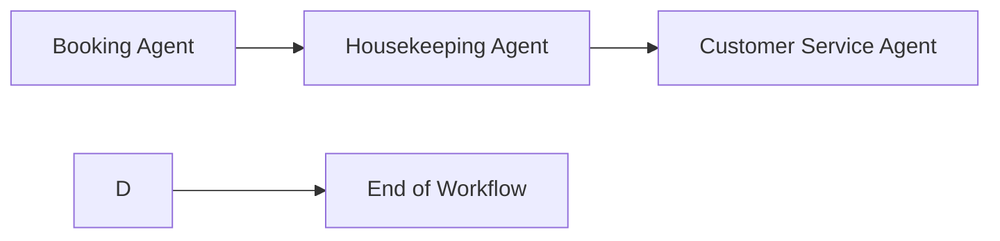

# 🎓 Capstone Project: Multi-Agent Hotel Management System (Mocked)

---

## 🎯 Objective
Design and implement a **multi-agent hotel management system** using **LangGraph** to simulate interactions between hotel departments. This system will:
✅ Showcase collaboration of agents for hotel operations  
✅ Mock real-world APIs/data sources (no real connections!)  
✅ Demonstrate workflow orchestration using **LangGraph**

---

## 🏗️ Agents in the Hotel Management System
Here’s an overview of the agents and their responsibilities:

| Agent                  | Responsibility                                                |
|------------------------|---------------------------------------------------------------|
| **Booking Agent**      | Mock room bookings (create, update, cancel)                   |
| **Housekeeping Agent** | Mock housekeeping status updates                              |
| **Customer Service Agent** | Handle customer inquiries and complaints (extend previous RAG)       |

---

## 🗺️ Workflow Example (LangGraph)

---

## 🏆 Deliverables for the Capstone:
- ✅ Source Code
- ✅ README.md – Setup, architecture diagram (Mermaid), usage guide
- ✅ Extensibility Guide – How to plug in real APIs/databases later

